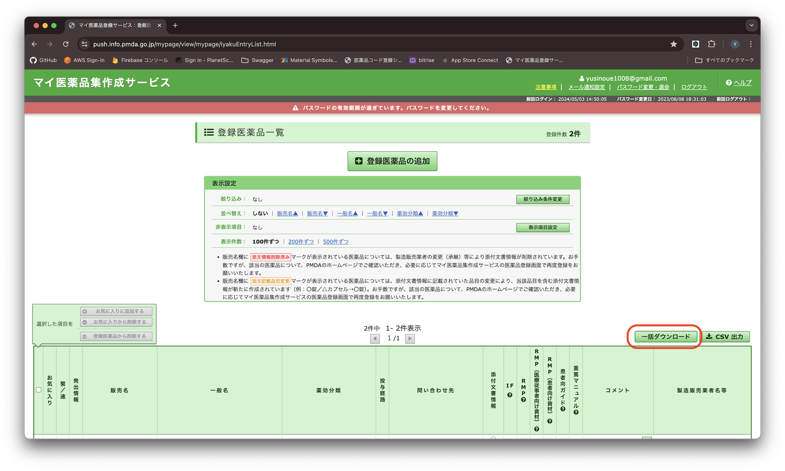
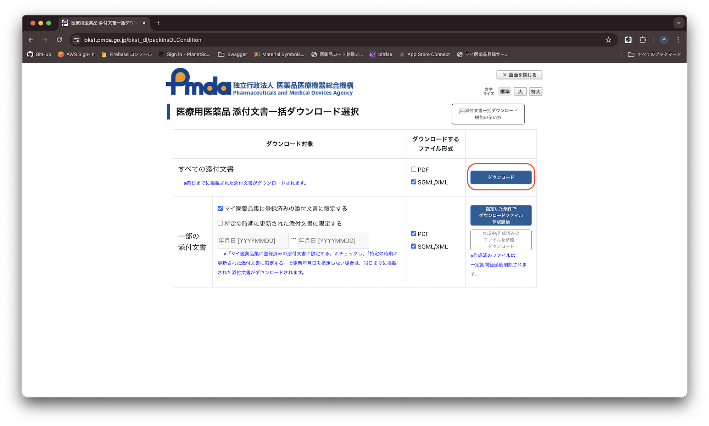

# 医薬品名 DB 作成手順

## 1. 医薬品リスト取得

- [マイ医薬品集作成サービス](https://push.info.pmda.go.jp/mypage/view/mypage/login.html) から `ファイルリスト.csv` をダウンロードする





## 2. DB ファイルの作成スクリプトの実行

- `data_cleaning.py` を実行する (事前に`ファイルリスト.csv` を同じディレクトリに格納しておく)

```zsh
pip3 install pandas # 初回のみ
python3 ./data_cleaning.py
```

## 3. DB ファイルを バンドルさせる

- `assets/database/` 直下に `kusuri.db` を格納する
